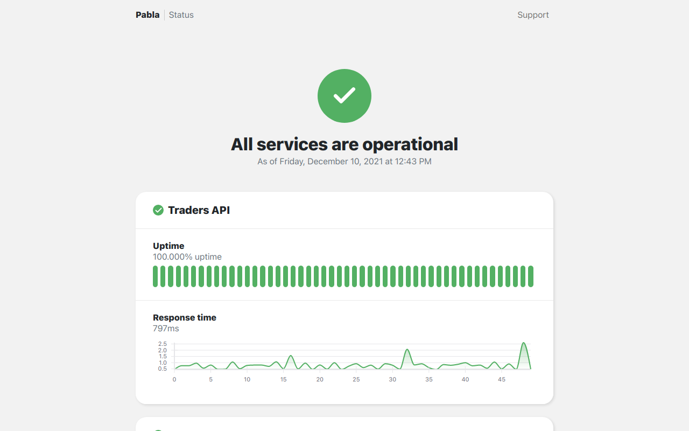

<br />
<div align="center">
  <a href="">
    
  </a>

  <h3 align="center">Cronitor StatusPage</h3>

  <p align="center">
    Create beautiful status pages for your applications in minutes
    <br />
    <a href="https://cronitor.io/docs"><strong>Explore Cronitor docs »</strong></a>
    <br />
    <br />
    <a href="https://cronitor-statuspage.vercel.app">View Demo</a>
    ·
    <a href="https://cronitor.io">Visit Cronitor</a>
  </p>
</div>

This project provides ability to create status pages for [Cronitor](https://Cronitor.io/) which is a simple monitoring system. Cronitor provides performance insights and uptime monitoring for cron jobs, websites, APIs and more.



## Getting Started

First, create a [Cronitor](https://cronitor.io/signup) account and setup your monitors. [Read cronitor guides](https://cronitor.io/docs/guides)

Then in your Cronitor dashboard go to Settings and look for [API](https://cronitor.io/app/settings/api) section. There you can find your API keys which we're gonna use to setup your status page. Copy your API key!

Clone this project: 

```bash
git clone https://github.com/cronitorio/cronitor-statuspage.git
```

Duplicate ```.env_``` and rename it to ```.env```, then fill the placeholder variables with your own:

```bash
cp .env_ .env
nano .env
```

That's it, your status page is ready!

## Deployment
To deploy the project to a production environment:

```bash
yarn
yarn build
yarn start
```

## Development
First install dependencies and then run the development server:

```bash
npm run dev
# or
yarn dev
```

Open [http://localhost:3000](http://localhost:3000) with your browser to see the result.


## Deploy on Vercel

The easiest way to deploy your status page is to use the [Vercel Platform](https://vercel.com/new).

